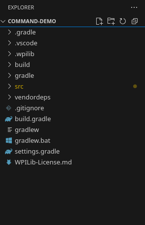

# Code Structure

Open a new FRC VS Code window, create a new project (`ctrl+shift+p`, then select `WPILib: Create a new project`) and follow the instructions below:

```text
select a project type: template
select a language: Java
select a project base: Command Robot

base folder: use a proper folder
project name: give it a proper name

team number: 1114(your team number)
```

After WPILib generates the project, you will see the structure of the robot code is shown on file explorer:



Here is the full view:

```text
project-name/
├── .gradle/
├── .vscode/
├── .wpilib/
├── build/
├── gradle/
├── src/
│   └── main/
│       ├── deploy/
│       └── java/
│           └── frc/
│               └── robot/
│                   ├── Main.java
│                   ├── Robot.java
│                   ├── RobotContainer.java
│                   ├── Constants.java
│                   ├── commands/
│                   └── subsystems/
├── vendordeps/
├── .gitignore
├── build.gradle
├── gradlew
├── gradlew.bat
├── settings.gradle
└── WPILib-License.md
```

It looks a little bit complicated, but for now we only care about files under `src/main/java/frc/robot`, which contains `Main.java`, `Robot.java`, `RobotContainer.java`, `Constants.java` and `commands.java`. Let's talk about them separately.

## Main.java

This is the entrypoint of your robot code. `Robot::new` represents a constructor reference, which works the same way as:

```java
RobotBase.startRobot(() -> new Robot());
```

Generally, you DON'T have to touch Main.java.
