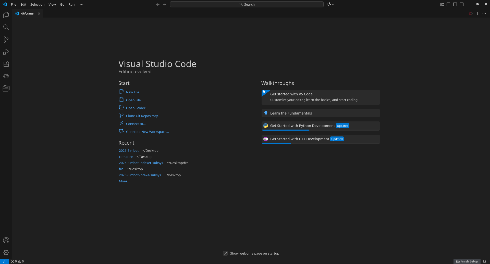
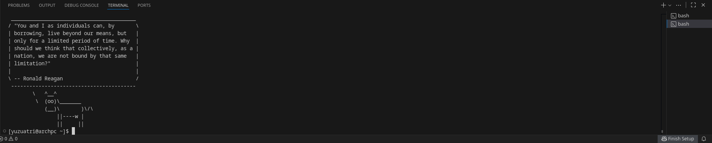
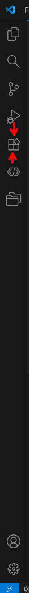
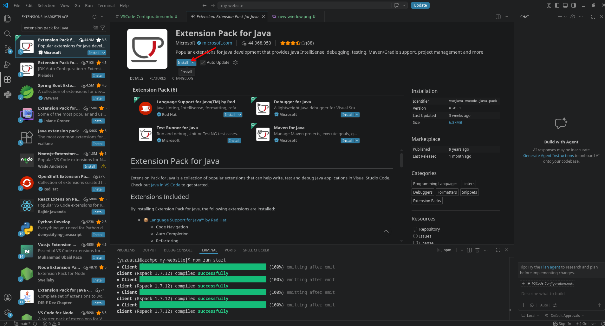

# FRC VSCode Configuration

VSCode (Visual Studio Code) is a free, light weight source code editor made developed by Microsoft. It's very popular and has become the official FRC code editor since 2019.

## Layout

When you open VS Code, you'll land on the **Welcome** tab.

### Key areas

- **Activity Bar** (far left column of icons) — switch between Explorer, Search, Source Control, Run/Debug, Extensions, and Accounts/Settings at the bottom.
- **Side Bar** — expands from whichever Activity Bar icon is selected (file tree, search results, git changes, etc.)
- **Editor** — main pane where files open; supports split view for side-by-side editing.
- **Panel** (bottom) — Terminal, Problems, Output, Debug Console.
- **Status Bar** (bottom strip) — branch name, line/column position, language mode, errors/warnings count.
- **Recent** (Welcome tab, left) — quick links to your last-opened folders. Once you've opened the team repo once, it'll show up here.
- **Walkthroughs** (Welcome tab, right) — optional guided tutorials for VS Code basics or language-specific setup (Python, C++, etc.).

### Hotkeys

| Action                              | Key                 |
| ----------------------------------- | ------------------- |
| Command Palette (search any action) | `Ctrl+Shift+P`      |
| Quick Open (jump to file)           | `Ctrl+P`            |
| Toggle Sidebar                      | `Ctrl+B`            |
| Toggle Terminal                     | `` Ctrl+` ``        |
| Split Editor                        | `Ctrl+\`            |
| Go to Definition                    | `F12`               |
| Go to Line                          | `Ctrl+G`            |
| Find / Replace                      | `Ctrl+F` / `Ctrl+H` |
| Find in Files (project-wide)        | `Ctrl+Shift+F`      |
| Rename Symbol                       | `F2`                |
| Format Document                     | `Shift+Alt+F`       |
| Comment/uncomment line              | `Ctrl+/`            |
| Open Settings                       | `Ctrl+,`            |

Tip: if you forget a shortcut, just open the Command Palette (`Ctrl+Shift+P`) and type what you want to do — it lists the matching command and its hotkey.

### Terminal

Use hotkey bind `` Ctrl+` `` to create a new terminal. It's mainly used to run **Git commands**. Git is a version-control tool with which you can have multiple people working on the same project using git repository platforms such as **GitHub**

### Extensions

Extensions add extra functionality to VS Code — language support, linters, formatters, Git tools, themes, and more. They make coding faster and catch errors early, so it's worth installing ones relevant to whatever we're working on. For FRC programming we will be using `Extension Pack for Java`.

Click on `Extensions` on the activity bar.

In the search bar, type `Extension Pack for Java`.

Select the extension and click `install`.

After the installation is finished, you should be able to find the extension in the `Extensions` section.
