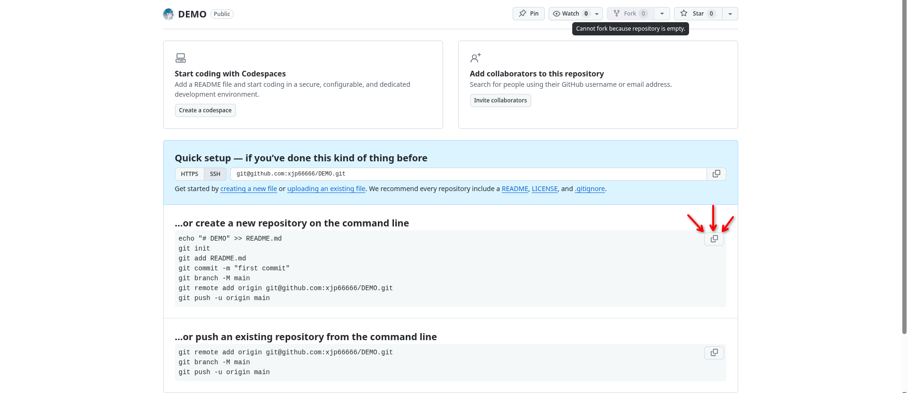
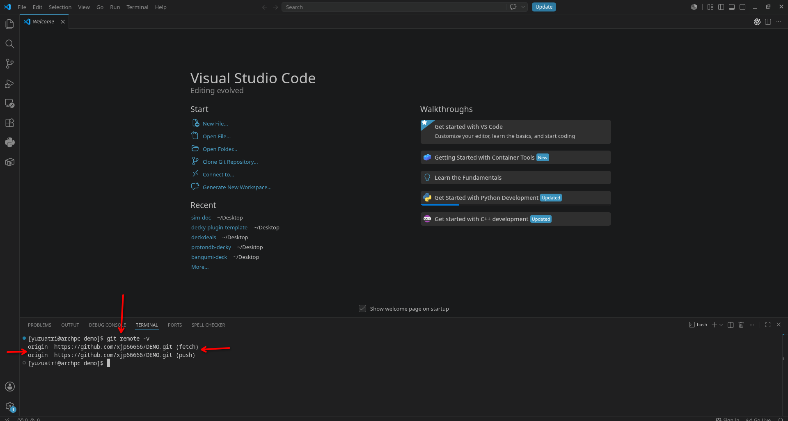

import Tabs from "@theme/Tabs";
import TabItem from "@theme/TabItem";

# Version Control

Version control tracks changes to files over time, so you can see what changed, undo mistakes, and let multiple people work on the same project without overwriting each other. Git is the most popular vision-control tool programmers use. In this tutorial we are going to talk about the installation and configuration of Git, as well as how to use Git repo platforms like GitHub.

## Installation

[Official download page](https://git-scm.com/install)

<Tabs groupId="operating-systems">
  <TabItem value="win" label="Windows">
    Click on the [Click here to download](https://github.com/git-for-windows/git/releases/download/v2.55.0.windows.2/Git-2.55.0.2-64-bit.exe) link

    Open the installer you just downloaded, and keep all the settings as default. Wait for the installation to complete.

  </TabItem>
  <TabItem value="mac" label="macOS">
    Choose one of these options:

    **Homebrew**

    Install homebrew if you don't already have it, then:

    `$ brew install git`

---

    **MacPorts**

    Install MacPorts if you don't already have it, then:

    `$ sudo port install git`

---

    **Xcode Command Line Tools**

    Apple ships a binary package of Git with Xcode Command Line Tools. You can install this via:

    `$ xcode-select --install`

  </TabItem>
  <TabItem value="linux" label="Linux">
    **Debian/Ubuntu**

    For the latest stable version for your release of Debian/Ubuntu

    `# apt-get install git`

    For Ubuntu, this PPA provides the latest stable upstream Git version

    ```bash
    # add-apt-repository ppa:git-core/ppa
    # apt update; apt install git
    ```

    **Fedora**

    `# yum install git` (up to Fedora 21)

    `# dnf install git` (Fedora 22 and later)

    **Gentoo**

    `# emerge --ask --verbose dev-vcs/git`

    **Arch Linux**

    `# pacman -S git`

    **openSUSE**

    `# zypper install git`

    **Mageia**

    `# urpmi git`

    **Nix/NixOS**

    `# nix-env -i git`

    **FreeBSD**

    `# pkg install git`

    **Solaris 9/10/11 (OpenCSW)**

    `# pkgutil -i git`

    **Solaris 11 Express, OpenIndiana**

    `# pkg install developer/versioning/git`

    **OpenBSD**

    `# pkg_add git`

    **Alpine**

    `$ apk add git`

    **Red Hat Enterprise Linux, Oracle Linux, CentOS, Scientific Linux, et al.**

    RHEL and derivatives typically ship older versions of git. You can [download a tarball](https://www.kernel.org/pub/software/scm/git/) and build from source, or use a 3rd-party repository such as the [IUS Community Project](https://ius.io/) to obtain a more recent version of git.

    **Slitaz**

    `$ tazpkg get-install git`

  </TabItem>
</Tabs>

## Configuring

1. Open a [terminal](./VSCode-Configuration#terminal) in VSCode
2. Set a Git username:

```bash
git config --global user.name "FIRST_NAME LAST_NAME"
```

3. Confirm that you have set the Git username correctly:

```bash
$ git config --global user.name
> FIRST_NAME LAST_NAME
```

4. Set a commit email:

```bash
git config --global user.email "YOUR_EMAIL"
```

5. Confirm that you have set the email address correctly in Git:

```bash
$ git config --global user.email
email@example.com
```

## Making a GitHub Account

GitHub is a website where developers can store and share projects that use Git. It allows multiple people to work on the same codebase, review each other’s changes, track problems, and
keep an online copy of their work. Git runs on your computer, while GitHub hosts your Git repositories online.

<a href="https://github.com" target="_blank" rel="noopener noreferrer">
  Official GitHub Page
</a>

Click on `Sign up for GitHub` to make a new account. It does not matter wether you use your personal account or school account, since GitHub allows multiple emails to be connected to one GitHub account. Be aware that if you are using school account, you have to sign up through Google, and **you are not going to have access to your account after you graduate.**

Then, ask one of our programming mentors to add you to `Simbotics` organization. After that you will be able to access to our GitHub repos.

## Authenticating with GitHub from Git

1. In VS Code, click the Accounts icon in the bottom-left corner.

2. Select Sign in with GitHub and approve the request in your browser.

3. Make a new folder for testing out Git

4. Make a new repo on GitHub: [Click me to make a repo](https://github.com/new)

5. Give your repo a name, then click `Create Repository`.

6. Copy the commands under `…or create a new repository on the command line`:



7. Go back to VSCode and open the folder you just created. Open a terminal and paste the commands you copied. Press `Enter`.

8. Run the command below to check if Git is connected to the repo:

```bash
git remote -v
```

You should see results like below:



## Trying Version Control

Now we will use the `DEMO` repository you just created to see how Git saves changes and separates work into branches.

### Making Your First Commit

In the VS Code Explorer, create a new file named `demo.txt`. Add this line to the file and save it:

```text
This file is on the main branch.
```

Open the terminal and run:

```bash
git add demo.txt
git commit -m "Add demo text file"
git push
```

`git add` selects the file, `git commit` saves a checkpoint, and `git push` sends that checkpoint to GitHub.

{/* Image suggestion: VS Code showing demo.txt and the successful commit in the terminal. */}

### Making the First Branch

A branch is a separate version of the repository. Create and switch to a branch named `first-change`:

```bash
git switch -c first-change
```

The branch name in the bottom-left corner of VS Code should change from `main` to `first-change`.

Change `demo.txt` to:

```text
This file was changed on the first branch.
```

Save and commit the change:

```bash
git add demo.txt
git commit -m "Change text on first branch"
```

{/* Image suggestion: demo.txt open beside the bottom-left first-change branch label. */}

### Switching Back to Main

Switch back to the main branch:

```bash
git switch main
```

Open `demo.txt` again. It should say:

```text
This file is on the main branch.
```

Your change did not disappear. It is saved on `first-change`, while `main` still has the original file. Switch between them to compare:

```bash
git switch first-change
git switch main
```

Watch the text in `demo.txt` change when you switch branches.

### Making a Second Branch

While on `main`, create another branch:

```bash
git switch -c second-change
```

Create a new file named `second.txt` and add:

```text
This file only exists on the second branch.
```

Save and commit it:

```bash
git add second.txt
git commit -m "Add file on second branch"
```

You now have three different versions of the repository:

- `main` has the original `demo.txt`.
- `first-change` has the changed `demo.txt`.
- `second-change` has the original `demo.txt` and the new `second.txt`.

Use these commands to switch between them:

```bash
git switch main
git switch first-change
git switch second-change
```

Notice how the files change depending on which branch you are using. This allows different programmers to work on different changes without affecting each other.

{/* Image suggestion: VS Code Explorer shown once on each branch to compare the files. */}

### Sending the Branches to GitHub

Push both new branches so they also appear on GitHub:

```bash
git switch first-change
git push -u origin first-change

git switch second-change
git push -u origin second-change
```

Open the repository on GitHub and use the branch dropdown to switch between `main`, `first-change`, and `second-change`.

{/* Image suggestion: GitHub branch dropdown showing all three branches. */}

## Git Command Cheat Sheet

| Command | What it does |
| --- | --- |
| `git status` | Shows your current branch and changed files. |
| `git add FILE_NAME` | Selects a file for your next commit. |
| `git add .` | Selects all changed files for your next commit. |
| `git commit -m "MESSAGE"` | Saves a checkpoint with a short description. |
| `git push` | Sends your commits to GitHub. |
| `git pull` | Downloads the latest changes from GitHub. |
| `git branch` | Lists all branches on your computer. |
| `git switch BRANCH_NAME` | Switches to an existing branch. |
| `git switch -c BRANCH_NAME` | Creates a new branch and switches to it. |
| `git remote -v` | Shows which GitHub repository is connected. |

Replace `FILE_NAME`, `MESSAGE`, and `BRANCH_NAME` with your own information. For example:

```bash
git add demo.txt
git commit -m "Update demo file"
git switch first-change
```
