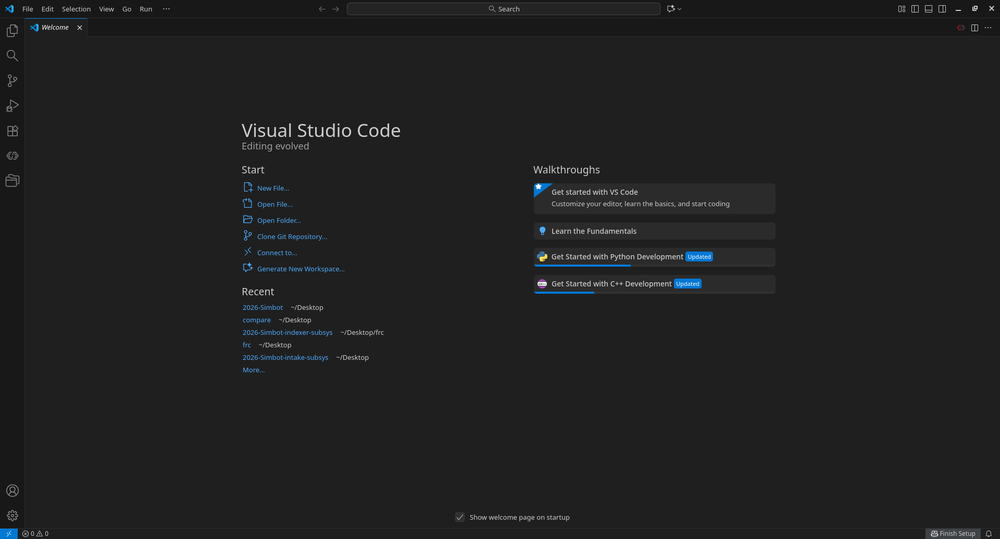
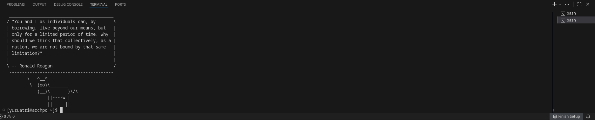
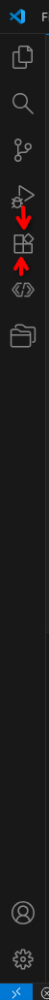
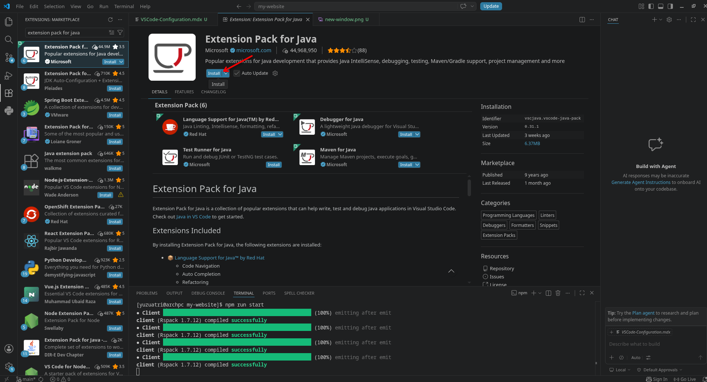

# FRC VS Code Configuration

Visual Studio Code (VS Code) is a free, lightweight source-code editor developed by Microsoft. WPILib includes a customized version of VS Code for FRC programming.

## Layout

When you open VS Code, you'll land on the **Welcome** tab.

### Key areas

- **Activity Bar** (far left column of icons) — switch between Explorer, Search, Source Control, Run/Debug, Extensions, and Accounts/Settings at the bottom.
- **Side Bar** — expands from whichever Activity Bar icon is selected (file tree, search results, Git changes, etc.).
- **Editor** — main pane where files open; supports split view for side-by-side editing.
- **Panel** (bottom) — Terminal, Problems, Output, Debug Console.
- **Status Bar** (bottom strip) — branch name, line/column position, language mode, errors/warnings count.
- **Recent** (Welcome tab, left) — quick links to recently opened folders. After you open the team repository, it will appear here.
- **Walkthroughs** (Welcome tab, right) — optional guided tutorials for VS Code basics or language-specific setup (Python, C++, etc.).

### Hotkeys

| Action                              | Key                 |
| ----------------------------------- | ------------------- |
| Command Palette (search any action) | `Ctrl+Shift+P`      |
| Quick Open (jump to file)           | `Ctrl+P`            |
| Toggle Sidebar                      | `Ctrl+B`            |
| Toggle Terminal                     | `` Ctrl+` ``        |
| Split Editor                        | `Ctrl+\`            |
| Go to Definition                    | `F12`               |
| Go to Line                          | `Ctrl+G`            |
| Find / Replace                      | `Ctrl+F` / `Ctrl+H` |
| Find in Files (project-wide)        | `Ctrl+Shift+F`      |
| Rename Symbol                       | `F2`                |
| Format Document                     | `Shift+Alt+F`       |
| Comment/uncomment line              | `Ctrl+/`            |
| Open Settings                       | `Ctrl+,`            |

Tip: If you forget a shortcut, open the Command Palette (`Ctrl+Shift+P`) and type what you want to do. It lists the matching commands and their keyboard shortcuts.

### Terminal

Press `` Ctrl+` `` to open a terminal. You will mainly use it to run **Git commands**. Git is a version-control tool that lets multiple people work on the same project, while platforms such as **GitHub** host Git repositories online.

### Extensions

Extensions add functionality to VS Code, including language support, linters, formatters, Git tools, and themes. For FRC programming, we will use the `Extension Pack for Java`.

Click **Extensions** in the Activity Bar.

In the search bar, type `Extension Pack for Java`.

Select the extension and click **Install**.

After the installation is finished, you should be able to find the extension in the `Extensions` section.
