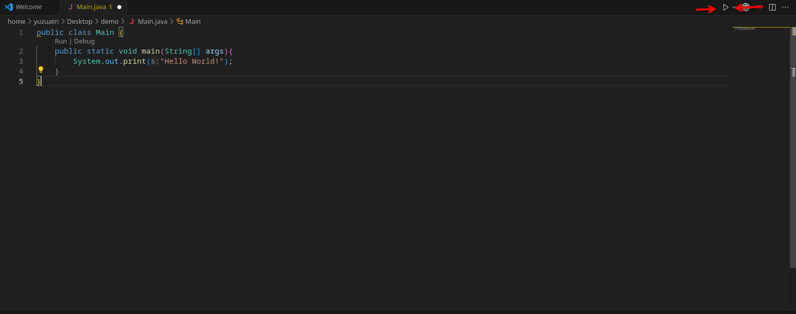
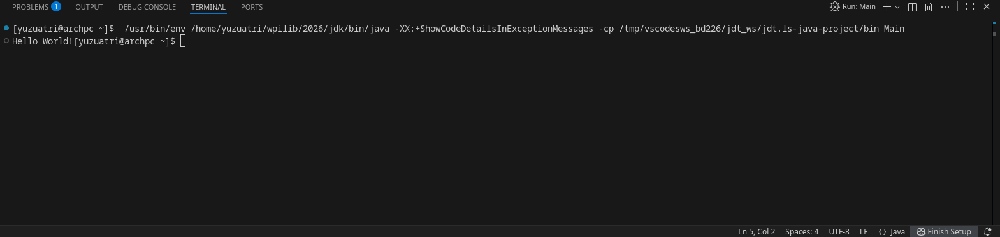

# Hello World

Open FRC VS Code and make a new file named `Main.java`, and type or copy & paste the code below:

```java
public class Main {
    public static void main(String[] args){
        System.out.print("Hello World!");
    }
}
```

Now, save the file to a proper directory, open a terminal ([cheat sheet for opening terminal](../get-ready/VSCode-Configuration#terminal))and click on the `Run Java` button on the top right corner of VS Code:



You should see "Hello World!" has been printed in the terminal:


